# IF3210 2021 K03 Android Project

## Deskripsi
Dalam tugas besar kali ini, kami membangun sebuah aplikasi pada platform Android untuk menunjang kegiatan workout. Fitur-fitur yang ada di dalam aplikasi kami adalah Sports News, Training Tracker, Training History, dan Training Scheduler.

Pada fitur Sports News, kami menggunakan RecyclerView untuk menampilkan list berita. Fitur Sports News juga akan menampilkan halaman yang responsive, apabila pada orientasi portrait akan menampilkan 1 kolom list berita, sedangkan pada orientasi landscape akan menampilkan 2 kolom list berita. Kami juga menyimpan history dan schedule ke dalam SQLite. Penggunaan Fragment digunakan untuk fitur Training History, dimana halaman log list dan halaman log detail dapat ditampilkan pada halaman berbeda ketika orientasi portrait dan halaman yang sama ketika orientasi landscape.

## Fungsionalitas Aplikasi & Screenshot
Berikut penjelasan dari beberapa fungsionalitas dalam aplikasi : 
| No | Spesifikasi | Penjelasan |
|----|-------------|------------|
| 1  | Sports News | Pengguna dapat melihat berita olahraga yang diperoleh melalui Indonesia Sports News API. Terdapat halaman untuk menampilkan list berita dan setiap item dapat dibuka untuk menampilkan WebView dengan konten sesuai URL berita. |
| 2  | Training Tracker | Pengguna dapat melakukan “mulai” dan “selesai” mengenai pelacakan latihan yang memiliki dua jenis, yaitu Cycling dan Running. Pada mode Cycling, aplikasi akan melacak jarak tempuh dan rute yang dilalui oleh sepeda menggunakan GPS. Hasil pelacakan dapat dilihat berupa angka (km jarak tempuh) dan peta (garis rute sepeda). Pada mode Running, aplikasi akan melacak jumlah step yang dilakukan oleh pengguna. Sistem pelacakan berjalan pada background sehingga masih dapat berjalan meskipun aplikasi ditutup jika statusnya sedang aktif. Selain itu, pada halaman ini juga ditampilkan kompas yang selalu menunjuk ke arah utara, yang diimplementasikan dengan memanfaatkan sensor.|
| 3  | Training History | Terdapat halaman history yang menyimpan seluruh kegiatan latihan pengguna yang dilacak, ditampilkan dalam bentuk kalender. Setiap hari pada kalender dapat dibuka untuk menampilkan list log latihan, dengan setiap log dapat dibuka untuk menampilkan informasi detail seperti pada spesifikasi Training Tracker|
| 4  | Training Scheduler | Pengguna dapat menentukan jadwal latihan yang dapat dikustomisasi untuk berjalan secara suatu waktu spesifik, rutin per hari, ataupun rutin per hari tertentu. Selain itu, setiap jadwal latihan dapat dikaitkan pada jenis latihan tertentu (cycling, walking) dengan target sesuai masukan pengguna (misalnya 5 km atau 10000 langkah). Saat waktu mulai jadwal, aplikasi akan menampilkan notifikasi sesuai tipe dan target latihan. Pengguna juga dapat mengatur agar pelacakan dapat berjalan secara otomatis saat waktu mulai jadwal latihan. Saat waktu selesai jadwal, aplikasi akan menampilkan notifikasi. Jika opsi pelacakan otomatis dinyalakan, pada waktu selesai jadwal juga ditampilkan pencapaian pengguna yang disimpan pada history, lalu pelacakan dimatikan.|

## Screenshot Aplikasi
Berikut beberapa screenshot aplikasi saat dijalankan :

### Sports News
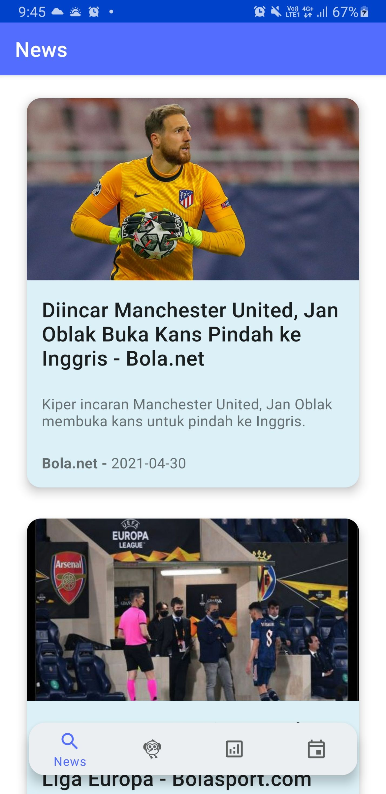
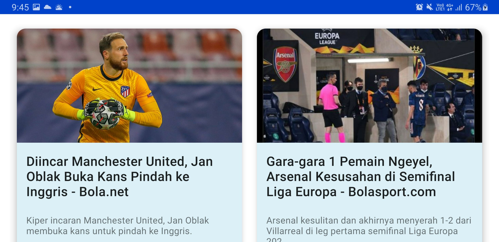

### News WebView
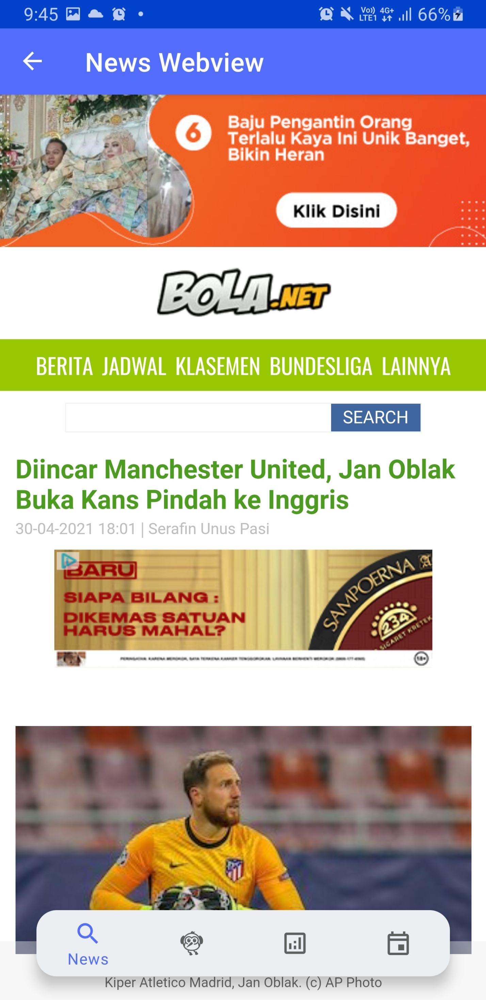

### Training Tracker
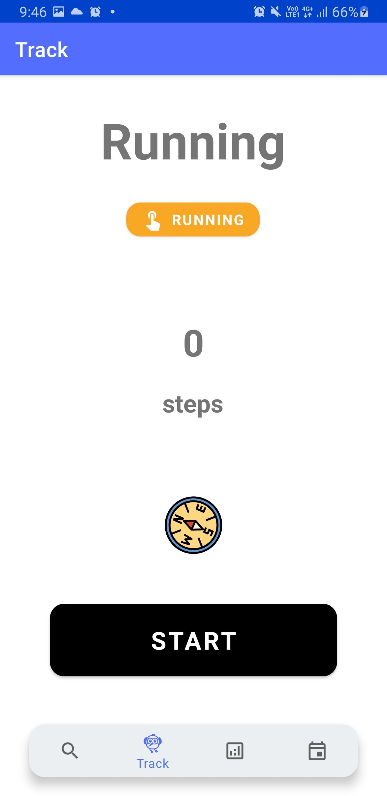
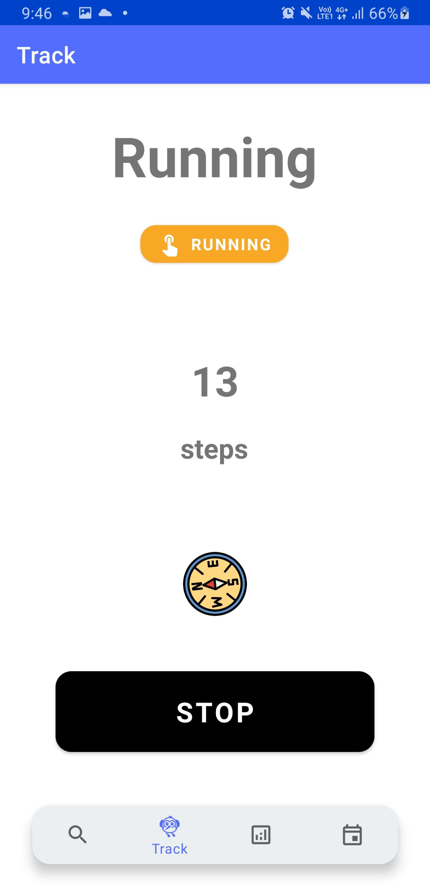
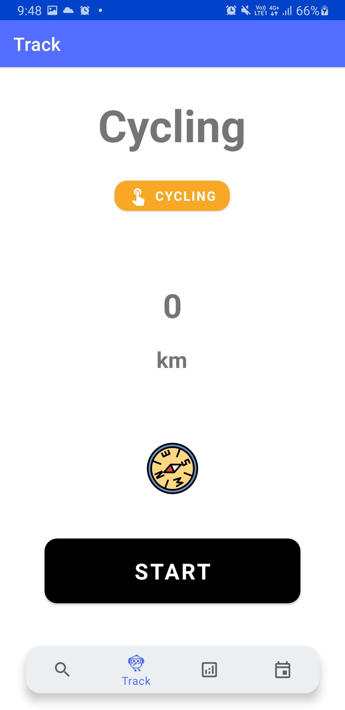
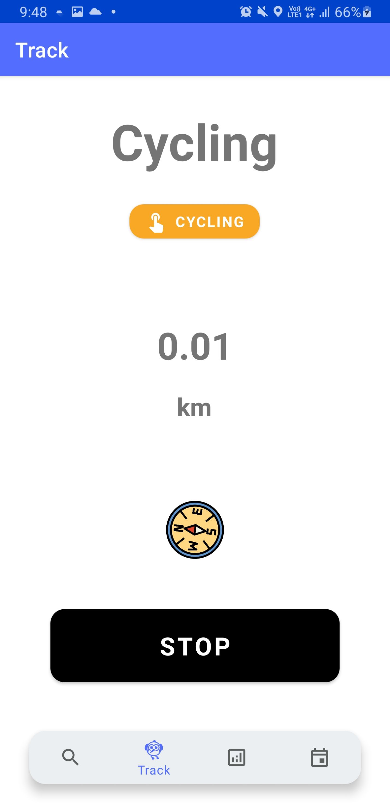

### Notification While App is Running
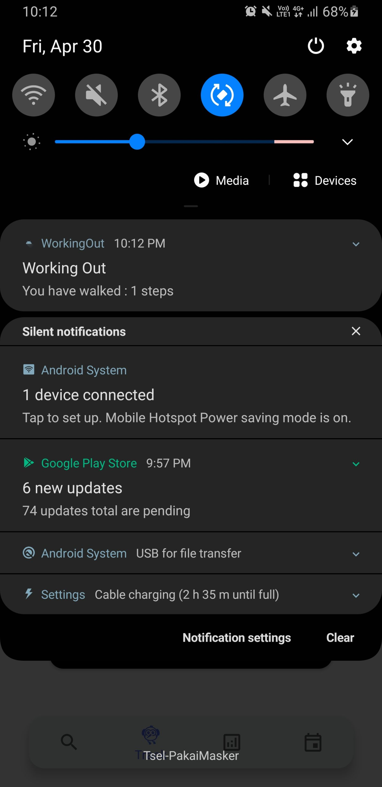

### Notification After App is Closed While Tracking
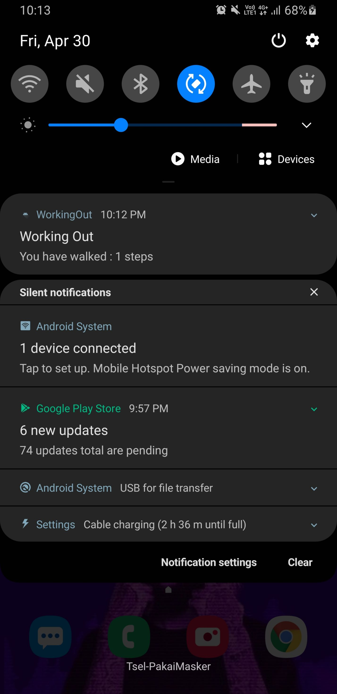

### Log Calendar
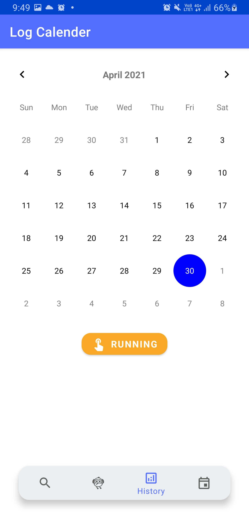
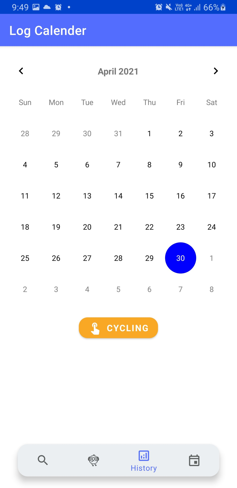

### Running Logs
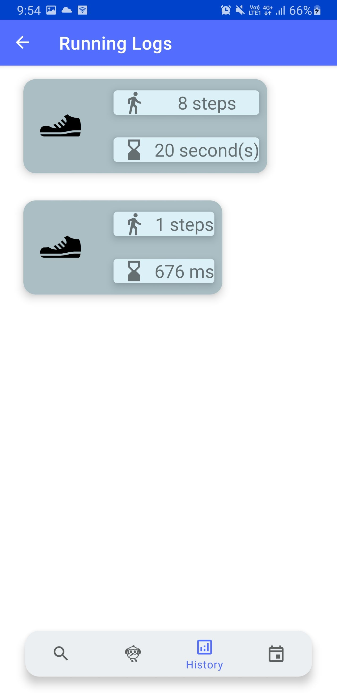
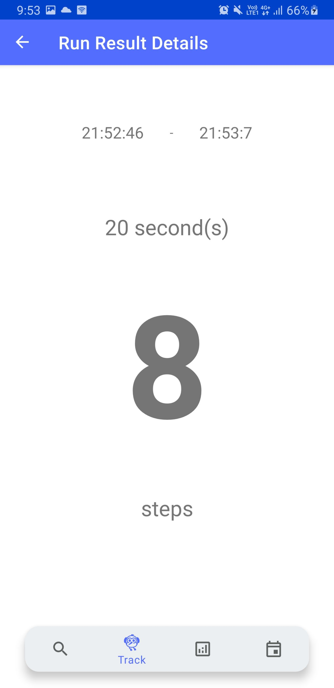
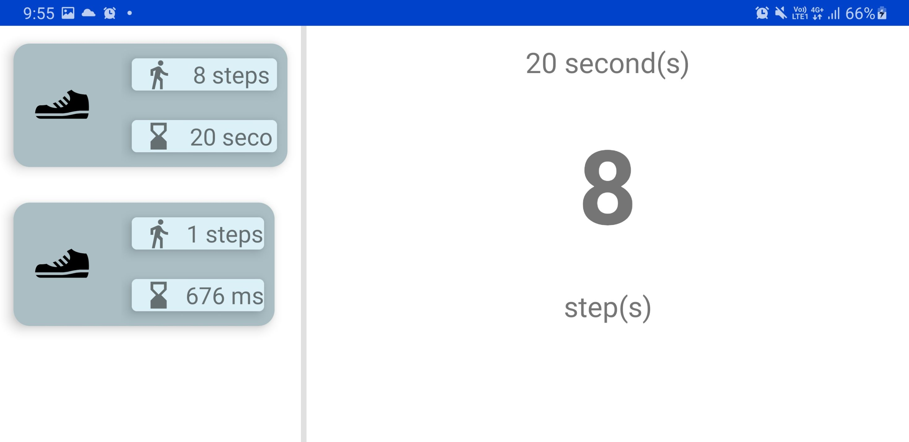

### Cycling Logs

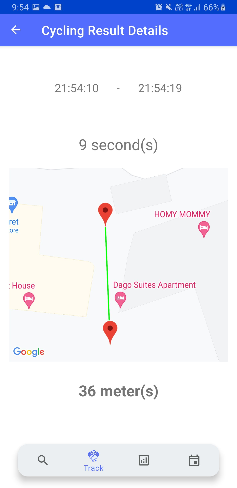
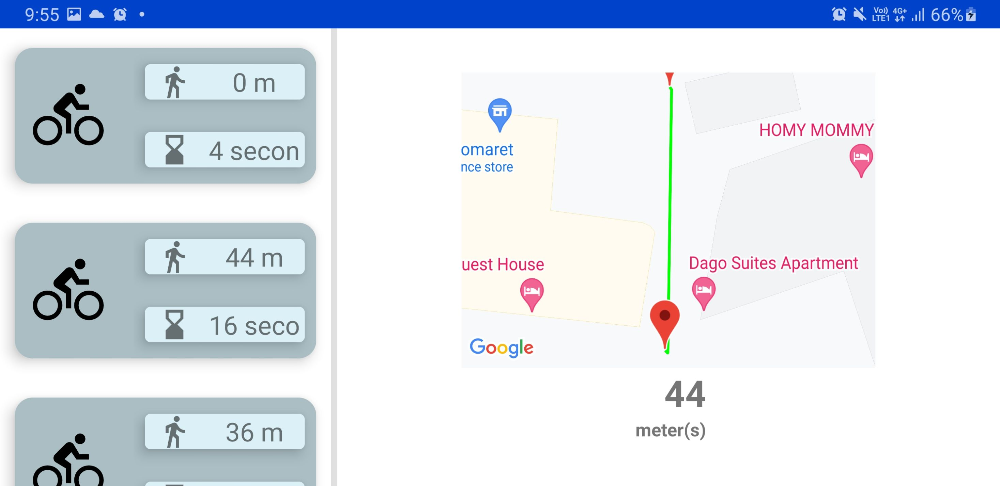

### Scheduler
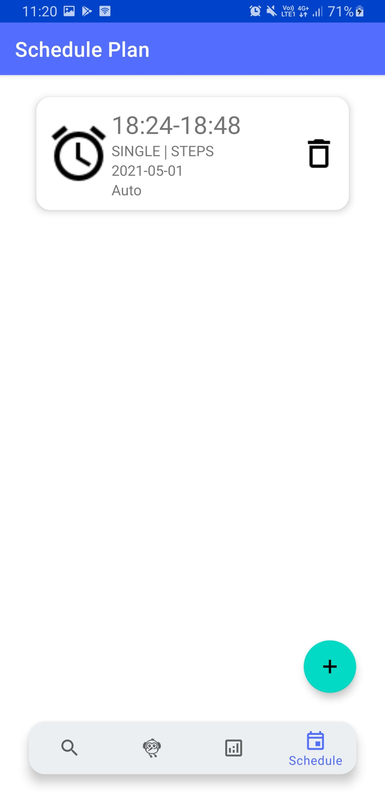
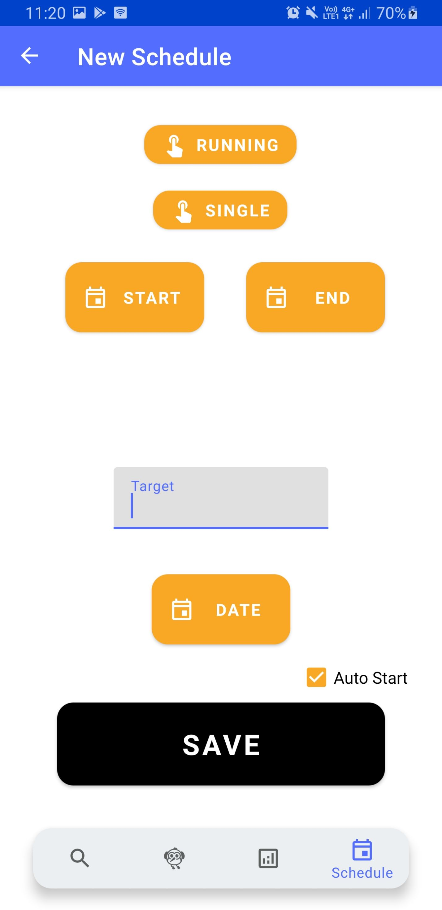
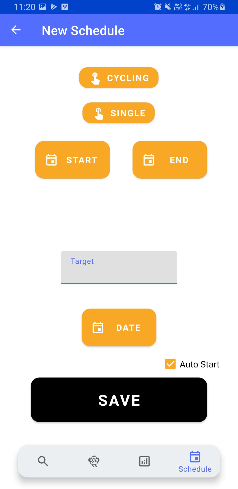

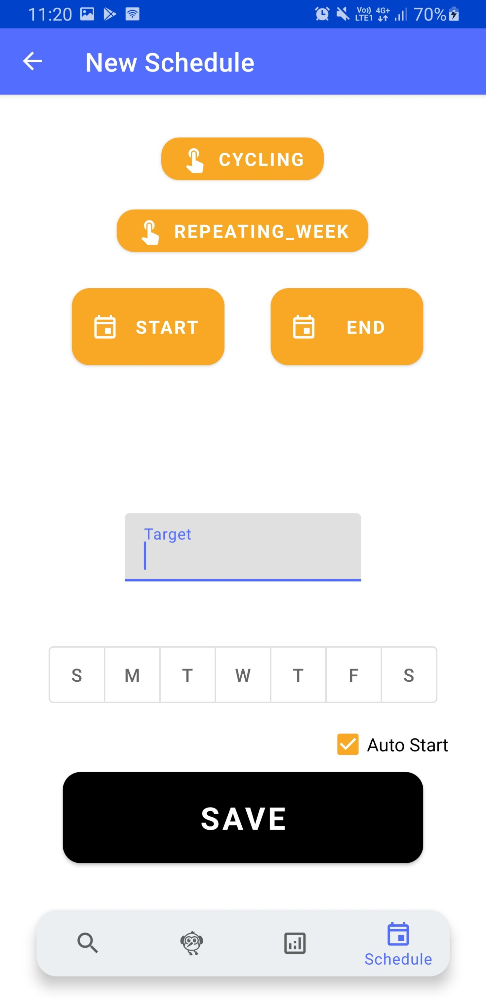
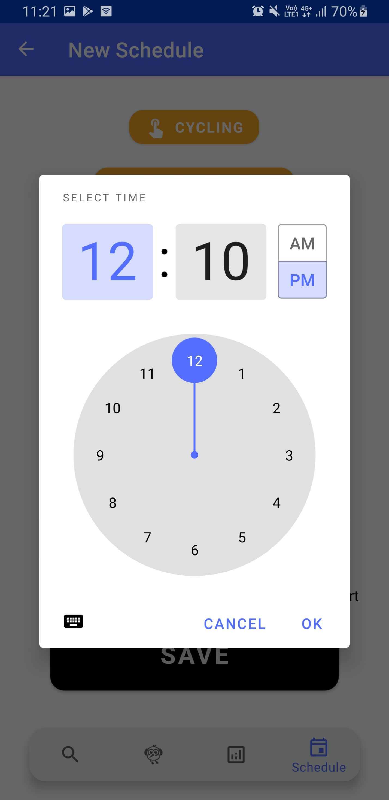

## Library

Berikut penggunaan library pada aplikasi :
| No | Library | Fungsi |
|----|-------------|------------|
| 1  | Material Design | Digunakan untuk mengimplementasikan Material Design pada aplikasi dengan API |
| 2  | Retrofit | Digunakan untuk membuat HTTP Request seperti pada fitur Sports News |
| 3  | Glide | Digunakan untuk membuat load gambar menjadi lebih efisien |
| 4 | Easy Permission | Digunakan untuk mengatur permission untuk mengakses privasi / sensor dari aplikasi |
| 5  | Google Maps Location Services | Digunakan untuk mengakses maps dari Google Maps seperti pada fitur Cycling Details |
| 6 | Room | Digunakan untuk pengaksesan database SQLite yang lebih baik |
| 7  | Dagger  & Dagger Hilt | Digunakan untuk melakukan dependencies injection |
| 8  | Material Calendar | Digunakan untuk membuat UI calendar untuk mencari tanggal pada log history |
| 9  | Two Pane Layout | Digunakan untuk pengimplementasian sliding pane untuk layout |

## Pembagian Kerja

* 13518003 - Dimas Lucky Mahendra

| No | Kontribusi |
|----|------------|
| 1  | Sports News UI Design | 
| 2  | Running Logs UI Design | 
| 3  | Cycling Logs UI Design | 
| 4  | Scheduler UI Design |
| 5  | Tester | 

* 13518006 - Ahadi Ihsan Rasyidin

| No | Kontribusi |
|----|------------|
| 1  | Single Alarm Without Date |
| 2  | Repeating Alarm |
| 3  | Layout Scheduler |
| 4  | Auto Tracker |
| 5  | Tester |

* 13518138 - William

| No | Kontribusi |
|----|------------|
| 1  | Sports News API Implementation |
| 2  | Sports News Webview Implementation |
| 3  | Training Tracker Running Implementation |
| 4  | Training Tracker Cycling Implementation |
| 5  | Training History Running Implementation |
| 6  | Training History Cycling Implementation |
| 7  | Training Scheduler Running Implementation notif only (single, repeating, repeating per week) |
| 8  | Training Scheduler Cycling Implementation notif only (single, repeating, repeating per week) |
| 9  | Training Scheduler Running Implementation auto tracker (single, repeating, repeating per week) |
| 10  | Training Scheduler Cycling Implementation auto tracker (single, repeating, repeating per week) |
| 11  | Training Tracker Main Page Design |
| 12  | 2 pane layout log history Design |
| 13  | Scheduler UI Design |

