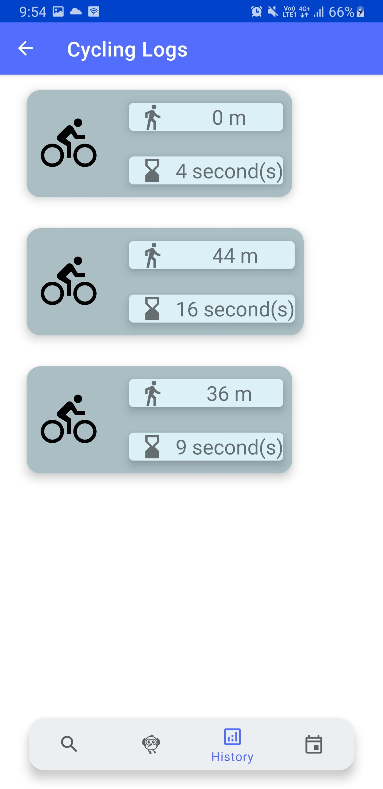

<p align="center">
    
    <h2 align="center">Workout</h2>
</p> 
<p align="center">An android application to make your life healtier</b></p>

> Have you ever started a fitness program and then quit? If you answered yes, you're not alone. Many people start fitness programs, but they may stop when they get bored.

**Introducing**...

An application that can motivate you to workout (running/cycling). The application have a lot of feature that will keep you to workout during pandemic!

## ✨ Features

- Workout Tracker (running/cycling)
- Workout History (running/cycling)
- Workout Scheduler (running/cycling)
- Workout Reminder
- Sports News

### Sports News
Because you need motivation and the news sport is the best motivation source :D.

<table>
  <tr>
    <td valign="mid">
        
    </td>
    <td valign="mid">
       
    </td>
    <td valign="mid">
       
    </td>
  </tr>
  <tr>
    <td><p align="center">Portrait</p></td>
    <td><p align="center">Landscape</p></td>
    <td><p align="center">Open the website..</p></td>
  </tr>
</table>


### Training Tracker

**As Main App**

<table>
  <tr>
    <td valign="mid">
        
    </td> 
    <td valign="mid">
        
    </td>
  </tr>
  <tr>
    <td><p align="center">Standby (Running Mode)</p></td>
    <td><p align="center">Working Out</p></td>
  </tr>
</table>

<table>
  <tr>
    <td valign="mid">
        
    </td> 
    <td valign="mid">
        
    </td>
  </tr>
  <tr>
    <td><p align="center">Standby (Cycling Mode)</p></td>
    <td><p align="center">Working Out</p></td>
  </tr>
</table>

**As Background App**

<table>
  <tr>
    <td valign="mid">
        
    </td> 
    <td valign="mid">
        
    </td>
  </tr>
  <tr>
    <td><p align="center">Still workout...</p></td>
    <td><p align="center">Finish</p></td>
  </tr>
</table>

### Training Tracker

**Calendar Logs**

<table>
  <tr>
    <td valign="mid">
        
    </td> 
    <td valign="mid">
        
    </td>
  </tr>
  <tr>
    <td><p align="center">Running Calendar</p></td>
    <td><p align="center">Cycling Calendar</p></td>
  </tr>
</table>

**History Details (running)**


<table>
  <tr>
    <td valign="mid">
       
    </td> 
    <td valign="mid">
        
    </td>
  <tr>
    <td><p align="center">Logs</p></td>
    <td><p align="center">Details</p></td>
  </tr>
</table>

**Landscape version..**


**History Details (cycling)**

<table>
  <tr>
    <td valign="mid">
    
    </td> 
    <td valign="mid">
        
    </td>
  <tr>
    <td><p align="center">Logs</p></td>
    <td><p align="center">Details</p></td>
  </tr>
</table>

**Landscape version..**


### Training Scheduler

<table>
  <tr>
    <td valign="mid">
   
    </td> 
    <td valign="mid">
    
    </td> 
    <td valign="mid">
   
    </td> 
    <td valign="mid">
        
    </td>
  <tr>
    <td><p align="center">List</p></td>
    <td><p align="center">Planner Form</p></td>
      <td><p align="center">Repeating</p></td>
    <td><p align="center">Repeating per Week</p></td>
  </tr>
</table>


## 📚 Tech Stack
To apps is built using Kotlin (Android) as base. Then we also use various library to integrate with the apps feature:
| No | Library | Functionality |
|----|-------------|------------|
| 1  | Material Design | Designing Application |
| 2  | Retrofit | Calling HTTP Request |
| 3  | Glide | Loading Image |
| 4 | Easy Permission | To make accessing (requesting) permission on android phone easier |
| 5  | Google Maps Location Services | Maps service to track user during workout |
| 6 | Room | Sqlite driver for android |
| 7  | Dagger  & Dagger Hilt | Dependencies injection library |
| 8  | Material Calendar | UI Library for calender logs |
| 9  | Two Pane Layout | UI Library for two pane system in workout history |

## 🚀 Quick start

We use <code>gradle</code> to build the android project

**Build and run the apps locally**

### Step 1: Clone The Repo

Fork the repository. then clone the repo locally by doing -

```bash
git clone https://github.com/William9923/WorkingOut
```

### Step 2: Run the Gradle task

cd into the directory
```bash
cd WorkingOut
```

install all the dependencies
```bash
gradle
```

### Step 3: Run in AVD or Android Phone

The apk is in `app\build\outputs\apk`.

Other alternative would be building the project inside an IDEA (like Intellij). 

## ❤️ Support
If you feel that this repo have helped you provide more example on learning software engineering, then it is enough for me! Wanna contribute more? Please ⭐ this repo so other can see it too!